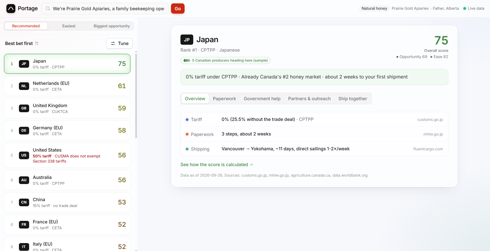
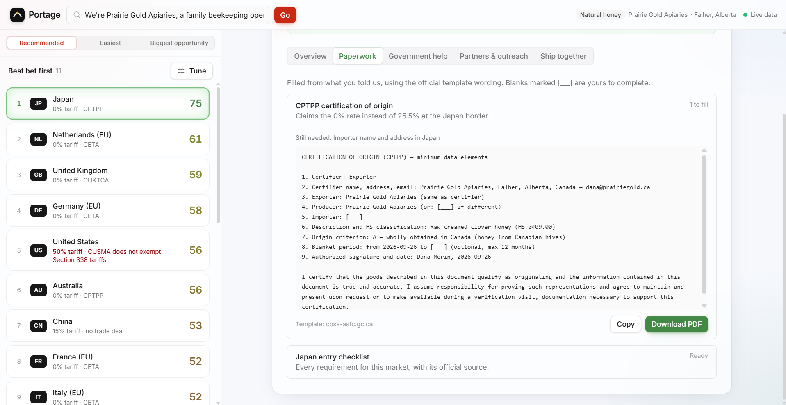
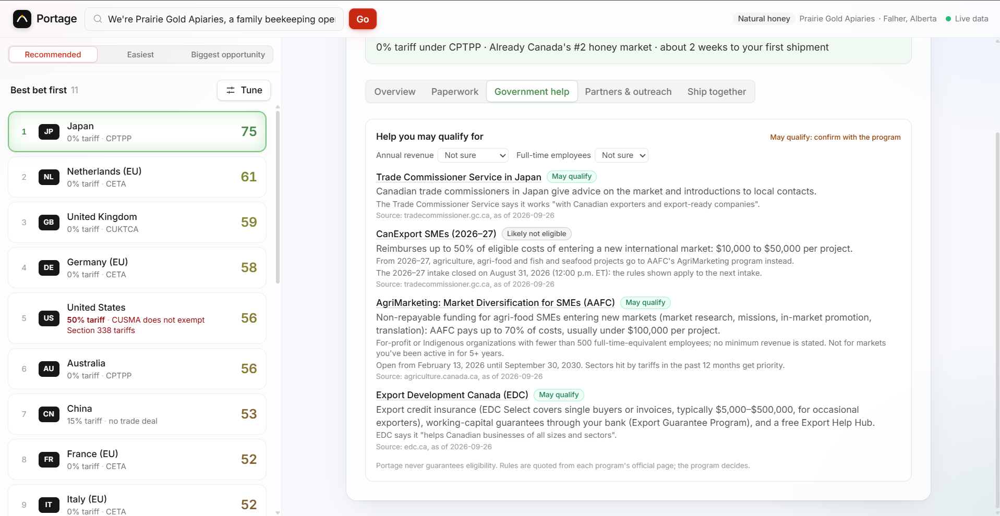
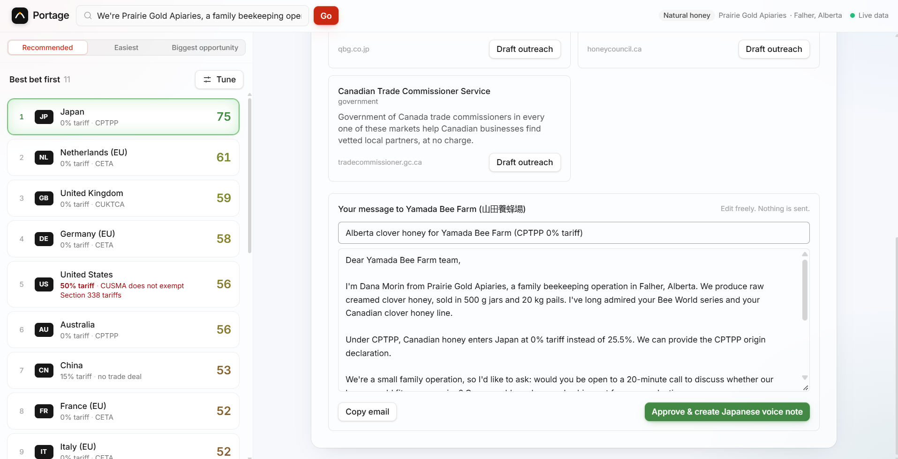
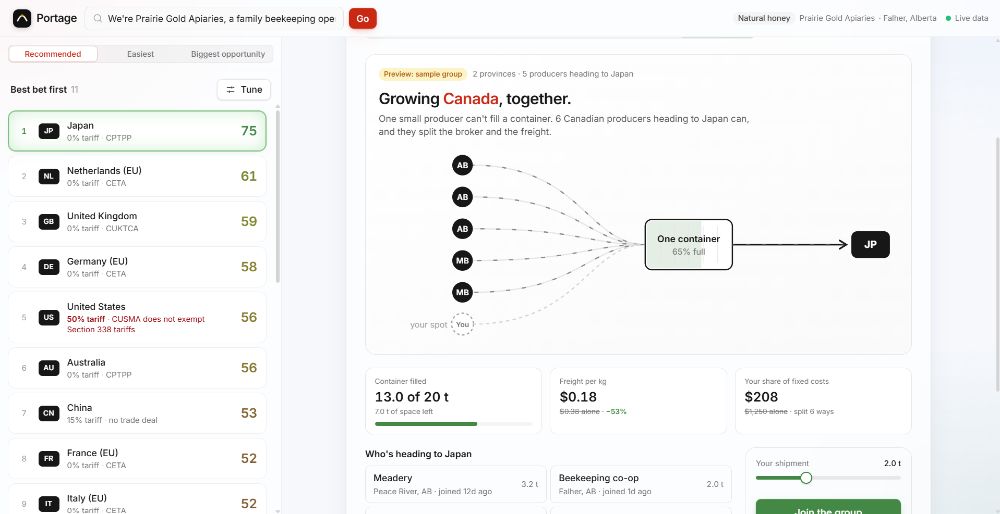
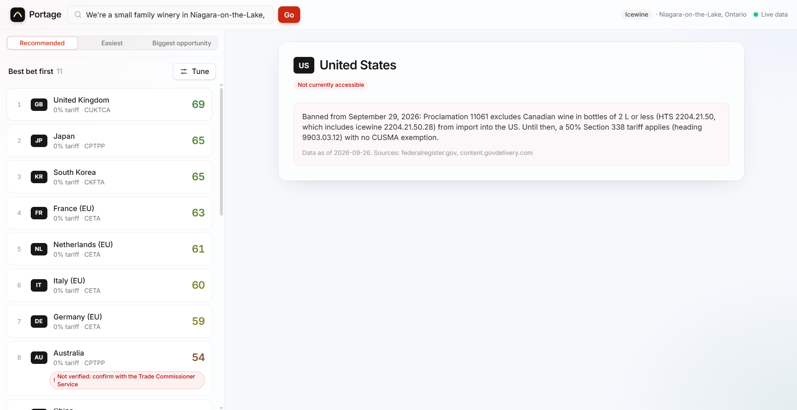

# Portage

**Portage helps small Canadian businesses find their next export market, and get their first shipment there.** Describe what you sell in plain English. Portage ranks the world's markets for your product from official data, drafts the paperwork, finds real buyers and writes to them, and groups you with other Canadian producers heading the same way so you can share a container.

Built in 24 hours at **AF Hacks: Growing Canada** (Waterloo, September 26–27, 2026).

**Demo video:** [watch on YouTube](https://youtu.be/y9kkX-867dw)

---

## Why Canada needs this

- **A small home market.** An American business has about 340 million customers at home before it needs to look abroad; a Canadian business has about 41 million.<sup>1</sup> To grow, Canadian businesses have to export.
- **Exporting has meant one country.** In 2024, 65.9% of Canada's 48,036 goods exporters sold only to the United States.<sup>2</sup>
- **That door just got much harder.** On August 22, 2026 the US put a 50% Section 338 tariff on hundreds of Canadian products, with no CUSMA exemption.<sup>3</sup> Natural honey is one of them, and the US was buying 68% of Canada's honey exports.<sup>4</sup> Canadian icewine is another, and from September 29, 2026 US imports of Canadian wine are banned outright.<sup>6</sup>
- **Small businesses don't have a trade department.** Exporting SMEs name shipping costs (66%), currency (56%) and duties and taxes (50%) as their top barriers; 80% rely on a customs broker; and between a third and three-quarters of trading SMEs don't know about federal programs like CanExport or the Trade Commissioner Service.<sup>5</sup>

The information to export exists, but it's spread across dozens of government sites and written for experts. Portage turns it into a plan a small business can act on tonight.

## What it does

1. **Ranks markets for your product.** Each market gets an **Opportunity** score (how much it buys, at what price, how fast it's growing, and how established Canadian products already are there) and an **Ease** score (tariffs, paperwork, shipping, currency and country risk, tax), combined into one recommendation. Closed markets are marked closed, not scored.
2. **Shows its work.** Every tariff and requirement links to its official source with a date. Every requirement carries a confidence badge (see below).
3. **Drafts the paperwork.** For example the CPTPP certification of origin that takes Canadian honey from 25.5% to 0% in Japan, pre-filled from what you told us, plus a market entry checklist, exportable as PDF.
4. **Points to government help.** The Trade Commissioner Service, CanExport, AAFC's AgriMarketing program and EDC, each with its eligibility rules quoted from the official page, and an honest "likely not eligible" when a business doesn't qualify.
5. **Finds a buyer and writes to them.** Real importers and distributors (checked, with their public pages), a drafted first email you edit and approve, and a **voice note in the buyer's language** generated with ElevenLabs.
6. **Ship together (preview).** One small producer can't fill a container; six can. Portage shows other Canadian producers heading to the same market, drafts one freight quote request for the whole group, and lists certified (CIFFA-member) freight forwarders that offer shared-container service. Portage is the matchmaker; licensed forwarders do the shipping.

## Screenshots

Demo profile: a small honey producer in Falher, Alberta (a sample business made up for the demo).

**Markets ranked for honey, with sources.** Japan comes first; the US drops down the list and Mexico is closed.


**Paperwork, pre-filled.** The CPTPP certification of origin that takes Canadian honey from 25.5% to 0% in Japan.


**Government help, with honest eligibility.**


**A first email to a real buyer, plus a voice note in Japanese.**


**Ship together (preview).** A sample group of Canadian producers heading to Japan, one freight quote request for all of them.


**Icewine.** The UK ranks first; the US is marked closed, banned from September 29, 2026.


## Honest about what it knows

Every requirement is labelled:

| Badge | Meaning |
|---|---|
| **Verified** | A person read the official source for this product and country. |
| **Auto-sourced** | Pulled automatically from an official government source (e.g. the UK Trade Tariff API, live), not yet checked by a person. Confirm with CFIA or the Trade Commissioner Service. |
| **Not verified** | No data yet. Portage says so and points you to the Trade Commissioner Service instead of guessing. |

**The AI never decides the facts.** The language model does two things: turn your description into a product profile, and draft messages. Rankings, tariffs, requirements and paperwork come from sourced data and fixed templates.

## What's real today, and what's next

| | Status |
|---|---|
| Market ranking, scores and sources for curated products: natural honey and icewine | Real, 11 markets (US, UK, Germany, France, Netherlands, Italy, Japan, South Korea, China, Australia, Mexico); honey verified in all, icewine verified in the UK, EU, Japan and Korea |
| Five more markets (Singapore, New Zealand, Vietnam, India, UAE) | Tariffs and trade data, marked "Not verified" |
| Ranking for **any product** (tariffs from WITS/UNCTAD TRAINS, trade data from UN Comtrade) | Real, live with caching |
| Import requirements for any product in the **UK** | Real, live from the UK Trade Tariff API |
| Paperwork drafts, government help, buyer outreach, voice notes | Real, for curated products |
| Ship together: the shipping group | **Preview with sample producers.** The freight quote request and forwarder list are real; grouping real users needs accounts and a shared database (next step) |
| Tariff and rule change alerts | Next |
| Partnerships with chambers of commerce and trade offices, who offer Portage to their members | Next |

## How the score works

```
friction    = 100 × (0.35·tariff + 0.30·compliance + 0.15·logistics + 0.10·risk + 0.10·tax)   lower is easier
ease        = 100 − friction
opportunity = 100 × (0.35·demand + 0.25·price after tariff + 0.15·growth + 0.25·Canada's foothold)
overall     = opportunity^a × ease^(1−a)     a = how much you care about opportunity vs ease (default 0.5)
```

A weighted sum rather than a model, so every number is explainable and traces back to a source. Weights are adjustable in the app. Full method, caps, sources and robustness checks: [`docs/SCORING.md`](docs/SCORING.md).

## Data sources

Customs and tariff schedules (CBP Section 338 list, Japan Customs, EU TARIC, UK Trade Tariff, CBSA), WITS / UNCTAD TRAINS, UN Comtrade, CFIA export requirements, foreign regulators (MHLW, MFDS, FSANZ and others), World Bank LPI, Bank of Canada exchange rates, OECD country risk classifications, AAFC, Statistics Canada, the Trade Commissioner Service, and the CIFFA member directory. Every data row in `backend/data/` carries its source URL and date.

## Tech

- **Backend:** Python, FastAPI, Pydantic; scoring engine and data in `backend/`; tests with pytest.
- **Frontend:** React 19, Vite, Tailwind CSS v4 in `frontend/`; tests with Vitest.
- **AI:** any OpenAI-compatible LLM (DeepSeek during the hackathon) for profile extraction and drafting; **ElevenLabs** (`eleven_multilingual_v2`) for voice notes in the buyer's language.
- **Live data:** UK Trade Tariff API, WITS/TRAINS, UN Comtrade, with caching and offline fallbacks so the app never dead-ends.

```
backend/   FastAPI app, scoring engine, sourced data (data/), tests
frontend/  React app
docs/      SCORING.md (method), API.md (endpoints), contract/ (shared types)
```

## Run it locally

You need Python 3.11+ and Node 20+.

**Windows:** double-click `backend\run.bat` (creates the venv, installs, runs the tests, starts the API), then `frontend\run.bat`. Open http://localhost:3000.

**Any OS, by hand:**

```bash
# terminal 1: backend
cd backend
python -m venv .venv
source .venv/bin/activate          # Windows: .venv\Scripts\Activate.ps1
pip install -r requirements.txt
cp .env.example .env               # add LLM_API_KEY and ELEVENLABS_API_KEY
uvicorn app.main:app --port 8000

# terminal 2: frontend
cd frontend
npm install
npm run dev                        # http://localhost:3000
```

Without API keys the app still runs: profile extraction and drafts fall back to offline templates, and voice notes are disabled. Interactive API docs: http://localhost:8000/docs.

## Sources for the numbers above

1. US Census Bureau, Vintage 2025 estimates (341.8M, July 1, 2025); Statistics Canada, quarterly estimates (41.4M, April 1, 2026).
2. Statistics Canada, *The Daily*, May 16, 2025.
3. U.S. Customs and Border Protection, Section 338 Canada HTS list (heading 9903.03.14 includes HTS 0409.00.00, natural honey).
4. Agriculture and Agri-Food Canada, *Statistical Overview of the Canadian Honey and Bee Industry, 2024* (share of export volume).
5. Canadian Federation of Independent Business, survey of January 2024.
6. Presidential Proclamation 11061 (91 FR 58311, September 14, 2026); CBP Section 338 list (HTS 2204.21.50, heading 9903.03.12).
